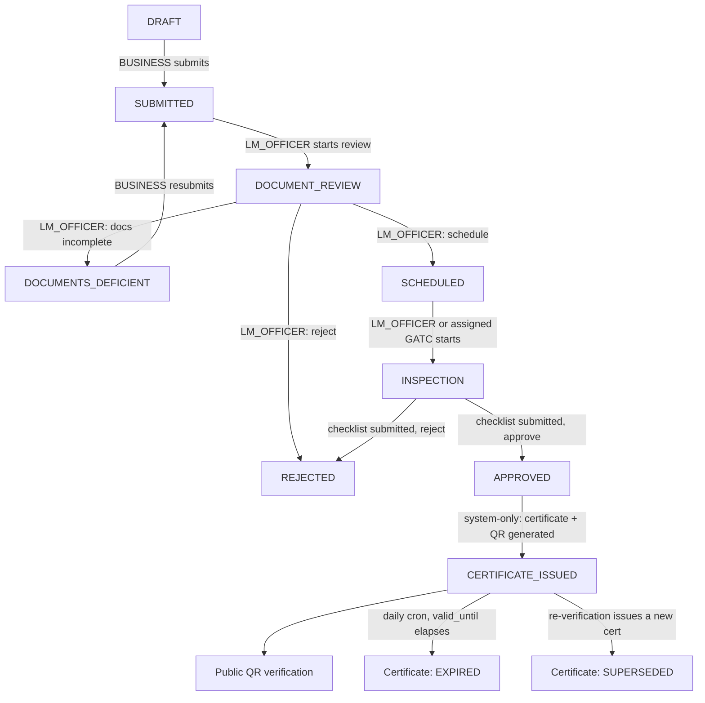

# MaapMitra — Legal Metrology Verification & Digital Certification Platform

Hackathon MVP. A digital lifecycle for Legal Metrology instrument verification — physical
verification stays a field activity; this digitizes the workflow around it.

```
Register instrument → Apply → Document review → Schedule → Field inspection
→ Approve/Reject → Certificate + QR → Public QR verification → Expiry → Re-verification
```

## Stack

| Layer | Choice | Host |
|---|---|---|
| Frontend | Next.js (App Router) + TypeScript + Tailwind + shadcn/ui | Vercel |
| Backend | FastAPI + Pydantic + SQLAlchemy + Alembic | Render |
| Database | Supabase Postgres | Supabase |
| Files | Supabase Storage (private buckets, signed URLs) | Supabase |
| Auth | Own JWT + RBAC in FastAPI | — |

Frontend → FastAPI → Supabase only. The frontend never touches the database directly. See root
[`CLAUDE.md`](./CLAUDE.md) for the full architecture rules, and [`backend/CLAUDE.md`](./backend/CLAUDE.md) /
[`frontend/CLAUDE.md`](./frontend/CLAUDE.md) for folder-specific conventions.

## Application lifecycle

Grounded in `backend/app/services/applications.py: ALLOWED_TRANSITIONS` — this is the actual
status machine, not an idealized diagram.



Notes on branches not obvious from the diagram:
- **GATC** reaches `SCHEDULED → INSPECTION → APPROVED/REJECTED` only once assigned to a specific
  inspection (`Inspection.assigned_officer_id`), and only for `OFFICE_TEST_CENTRE` applications —
  scheduling itself is always `LM_OFFICER`-only. GATC never issues a certificate.
- `APPROVED → CERTIFICATE_ISSUED` happens inside certificate creation, never via a direct status
  PATCH.
- **Payments are informational only.** A `mock-pay` action exists but no transition above reads or
  gates on payment status — an application can reach `CERTIFICATE_ISSUED` with no payment ever
  recorded.
- A certificate's `REVOKED` status exists in the schema (and is shown by `GET /verify` / admin
  stats) but no action currently sets it — there is no revoke endpoint in this MVP.

## Roles

`SUPER_ADMIN > STATE_ADMIN > DISTRICT_ADMIN > LM_OFFICER > GATC > BUSINESS > PUBLIC`

Org isolation is absolute: a business never sees another business's data.

## Demo login

Seeded by `database/seed/` ([full details](./database/seed/README.md)). All demo accounts share
one password — a **hackathon shortcut**, not a real secret; delete these accounts before any
production use.

**Shared demo password:** `LmDemo@2026`

| Email | Role | Scope |
|---|---|---|
| `admin@lm.demo` | SUPER_ADMIN | — |
| `state.jh@lm.demo` | STATE_ADMIN | JH |
| `district.dhn@lm.demo` | DISTRICT_ADMIN | JH / DHN |
| `officer.dhn@lm.demo` | LM_OFFICER | JH / DHN |
| `owner@abctraders.demo` | BUSINESS | ABC Traders (JH / DHN) — the demo story's main actor |
| `owner@othertraders.demo` | BUSINESS | Other Traders (JH / DHN) — org-isolation demo only |

### Live accounts (deployed Supabase backend)

Separate from the `database/seed/` accounts above — these exist directly on the live Supabase
database behind the deployed app, for judging/demo access across multiple states. All share one
password — a **hackathon shortcut**, not a real secret; delete or rotate before any production use.

**Shared password:** `12341234`

| Email | Role | Scope |
|---|---|---|
| `maapmitra@gmail.com` | SUPER_ADMIN | — |
| `state.jh@gmail.com` | STATE_ADMIN | Jharkhand (JH) |
| `state.ka@gmail.com` | STATE_ADMIN | Karnataka (KA) |
| `state.mh@gmail.com` | STATE_ADMIN | Maharashtra (MH) |
| `state.up@gmail.com` | STATE_ADMIN | Uttar Pradesh (UP) |
| `state.tn@gmail.com` | STATE_ADMIN | Tamil Nadu (TN) |
| `state.dl@gmail.com` | STATE_ADMIN | Delhi (DL) |

## Demo story

ABC Traders registers a weighing scale (serial `XYZ12345`, 500 kg, Dhanbad) → applies with
documents → an LM Officer inspects and approves → `CERT-2026-000123` with QR is issued → a
consumer scans it and sees ✓ VALID → expiry is tracked.

## Repo layout

```text
/
├── frontend/          ← Next.js app       → see frontend/CLAUDE.md
├── backend/           ← FastAPI service   → see backend/CLAUDE.md
├── database/seed/     ← demo seed data
└── docs/specs/        ← per-feature specs (01-16)
```
